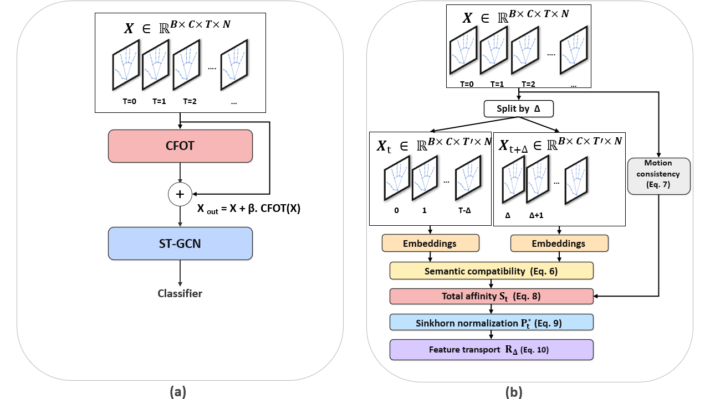

# CFOT: Cross-Frame Optimal Transport for Skeleton-Based Gesture Recognition

Official PyTorch implementation of the paper:

**Cross-Frame Optimal Transport Learning for Skeleton-Based Hand Gesture Recognition**  
*ICPR 2026 (under review)*

<p align="center">
  
</p>

---

## Overview

Cross-Frame Optimal Transport (CFOT) is a temporal modeling framework for
skeleton-based hand gesture recognition. CFOT explicitly discovers
long-range correspondences between skeletal joints across non-consecutive
frames using optimal transport, enabling robust recognition under temporal
variations and motion ambiguity.


# IPN Skeleton Dataset (MediaPipe Extracted)

This dataset contains **skeleton-based representations extracted using
Google MediaPipe** from the IPN Hand Gesture Dataset.

## Important Note

- This dataset contains **only derived skeleton data**

## Extraction Details

- Skeleton extractor: Google MediaPipe
- Joints: hand and upper-body landmarks
- Coordinates: (x, y, z)


📥 **Download link (Google Drive):**  
[IPN_Skeleton_MediaPipe.zip](https://drive.google.com/drive/folders/1E0On1mm5CJVTFMIKrySd6q0odkxmOjba?usp=drive_link)


---

## Pretrained Models

| Model        | Dataset  | Accuracy | Link                         |
|--------------|----------|----------|------------------------------|
| CFOT + ST-GCN | ISL      | 90.20%   | `pretrained/cfot_isl.pt`     |
| CFOT + ST-GCN | IPN      | 95.71%   | `pretrained/cfot_ipn.pt`     |
| CFOT + ST-GCN | Briareo  | 99.31%   | `pretrained/cfot_briareo.pt`|

---

### Environment setup
```bash
python -m venv cfot
source cfot/bin/activate  # Windows: cfot\Scripts\activate
pip install -r requirements.txt

```


---

## Quick Start (Evaluation)

Evaluate a pretrained CFOT model (Update the path of each dataset in connfig files , for cpu add --device cpu) :

-IPN
```bash
  python -m scripts.eval_ipn --config configs/ipn_stgcn.yaml --ann-test <"path to annot_TestList"> --ckpt pretrained/cfot_ipn.pt 
  ```

-ISL
```bash
  python -m scripts.eval_isl --config configs/ISL_stgcn.yaml --ckpt pretrained/cfot_isl.pt
```


-Briareo
```bash
  python -m scripts.eval_briareo  --config configs/briareo_stgcn.yaml   --ann-test <"path to npz_list>  --ckpt pretrained/cfot_briareo.pt 
```


---

## Training from Scratch

-IPN
```bash
  python -m scripts/train_ipn --config configs/ipn_stgcn.yaml
  ```


-ISL
```bash
  python -m scripts/train_isl --config configs/ISL_stgcn.yaml
```


-Briareo
```bash
  python -m scripts/train_briareo --config configs/briareo_stgcn.yaml
```


